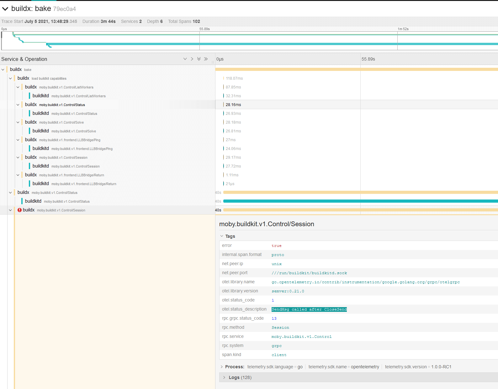

# OpenTelemetry support

To capture the trace to [Jaeger](https://github.com/jaegertracing/jaeger), set
`JAEGER_TRACE` environment variable to the collection address using a `driver-opt`.

First let's create a Jaeger container:

```shell
docker run -d --name "jaeger" -p "6831:6831/udp" -p "16686:16686" jaegertracing/all-in-one
```

Now let's [create a `docker-container` builder](../reference/buildx_create.md)
that will use the Jaeger instance:

```shell
docker buildx create --name "mybuilder" --use --driver "docker-container" --driver-opt "network=host" --driver-opt "env.JAEGER_TRACE=localhost:6831"
```

Boot and [inspect `mybuilder`](../reference/buildx_inspect.md):

```shell
docker buildx inspect --bootstrap
```

Buildx commands should be traced at `http://127.0.0.1:16686/`:


